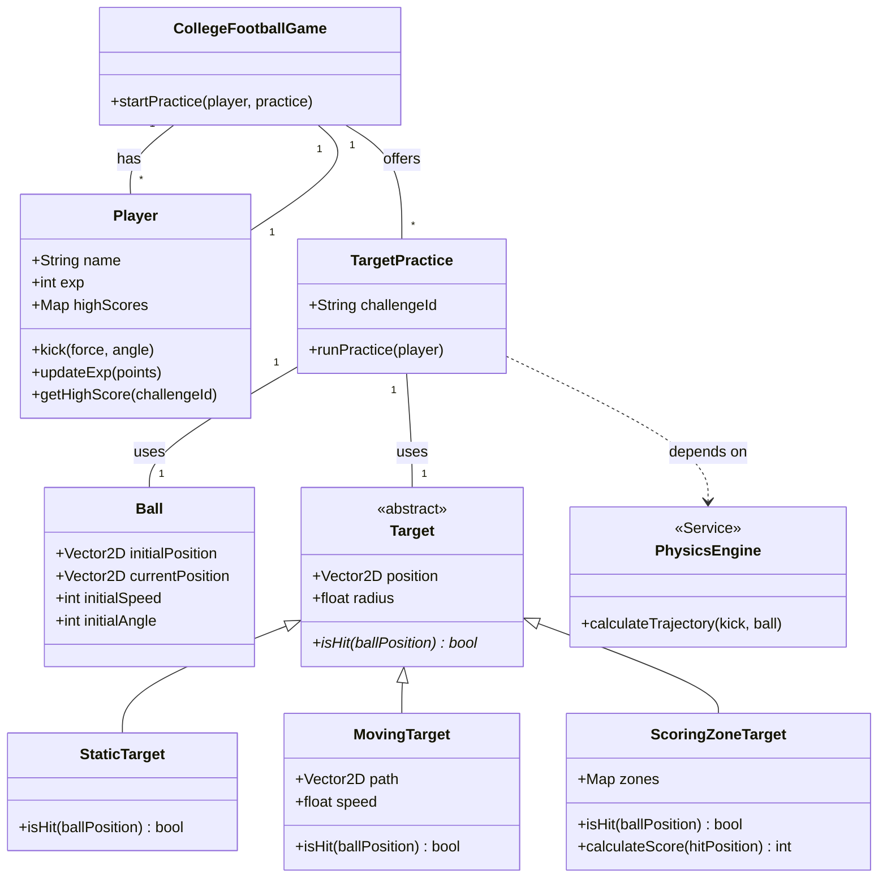

# College Football: Target Practice

This project is a skill-training module designed for a college football game. It provides a dedicated practice environment where players can hone their kicking skills by hitting various targets. The system is built with a focus on modularity and extensibility, allowing for new challenges and features to be added easily.

## Features

* **Realistic Physics**: A dedicated `PhysicsEngine` calculates the ball's trajectory based on player input.
* **Dynamic Challenges**: The `TargetPractice` class allows for the creation of numerous challenges with different balls and targets.
* **Variety of Targets**: The system supports multiple target types through inheritance, including:
    * `StaticTarget`: A simple, non-moving target.
    * `MovingTarget`: A target that moves along a predefined path.
    * `ScoringZoneTarget`: A target with different zones that award varying points.
* **Player Progression**: Players earn experience points (`exp`) and can track their `highScores` for each challenge, encouraging improvement and competition.

---

## Class Diagram

The following diagram illustrates the high-level architecture of the system, showing how the classes interact with each other.



---

## Class Definitions

* **`CollegeFootballGame`**: The main class that orchestrates the game. It holds collections of `Player`s and `TargetPractice` challenges.
* **`Player`**: Represents a player in the game. It manages player-specific data like `name`, `exp`, and `highScores`, and defines the `kick` action.
* **`TargetPractice`**: Manages the logic for a single practice session. It uses a `Ball`, a `Target`, and the `PhysicsEngine` to run a challenge for a `Player`.
* **`Ball`**: A simple data class representing the football, holding its position, speed, and angle.
* **`PhysicsEngine`**: A service class responsible for all physics calculations, specifically determining the ball's trajectory after a kick.
* **`Target` (Abstract)**: Serves as a template for all target types by defining a common interface. It cannot be instantiated directly. Instead, concrete subclasses like `StaticTarget` and `MovingTarget` must implement its `isHit()` method.
* **`StaticTarget`**: A concrete implementation of `Target` that does not move.
* **`MovingTarget`**: A `Target` that moves along a given path at a certain speed.
* **`ScoringZoneTarget`**: A `Target` that contains multiple scoring zones and can calculate points based on where it was hit.

---

## Additional Utilities: Inventory Management

Included in this project is a standalone inventory management utility. This command-line program allows you to track items, add new stock, and sell items.

### How to Test the Inventory System

You can compile and run this utility separately from the main football game project.

1.  **Compile**: Use the following command to compile the inventory program:
    ```bash
    g++ -std=c++11 -o inventory_manager task-4-starter.cpp
    ```
2.  **Run**: Execute the compiled program:
    ```bash
    ./inventory_manager
    
