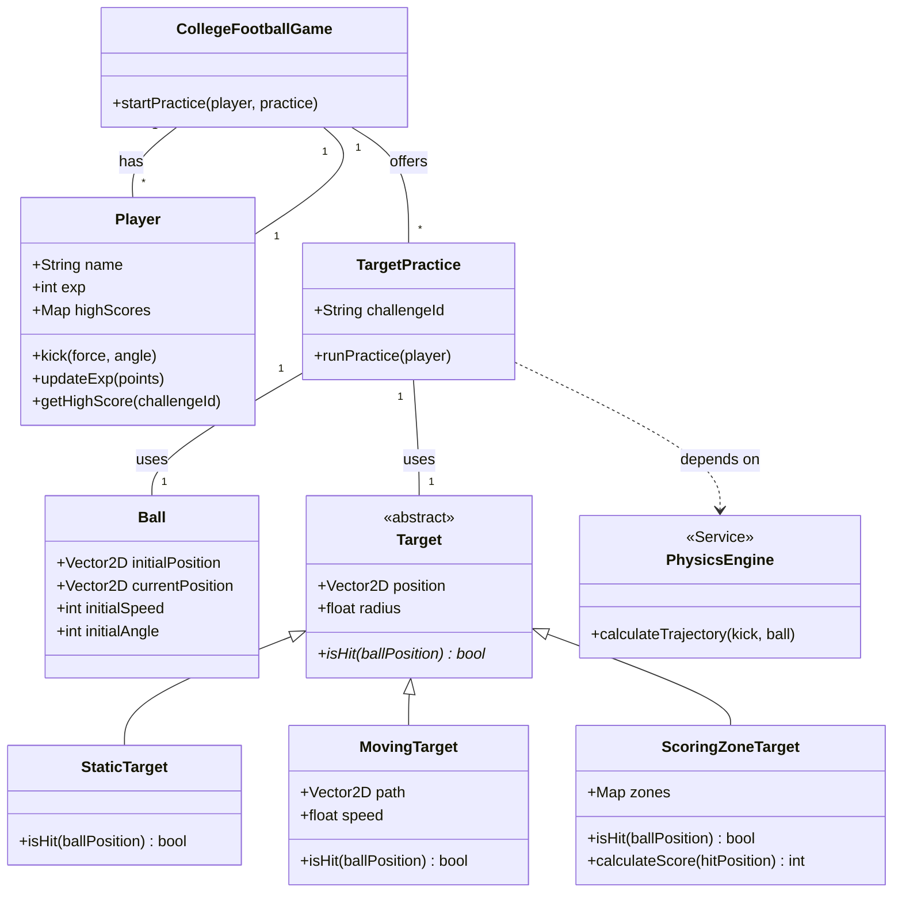

# EA Sports Gameplay Systems & Optimization

## Project Overview

This repository documents the successful completion of the **Electronic Arts (EA) Software Engineering Virtual Experience**. The project simulates a real-world development lifecycle for **EA Sports College Football**, focusing on feature innovation, object-oriented C++ implementation, and performance optimization. It showcases the ability to design, build, and refine game systems from concept to execution.

## Key Features & Accomplishments

* **Feature Innovation:** Authored a comprehensive feature proposal for a new gameplay mechanic, outlining technical specifications and stakeholder impact.
* **C++ Architecture:** Architected the foundational C++ framework for the new feature, designing a scalable object-oriented structure with UML class diagrams.
* **Performance Optimization:** Boosted application performance by identifying and patching a critical bug, optimizing the codebase through the implementation of a more efficient data structure.

## Technologies & Skills Demonstrated

* **Languages:** C++
* **Paradigms:** Object-Oriented Design (OOD), Data Structures, Algorithms
* **Tools:** Git, Version Control, UML
* **Skills:** Technical Writing, Code Optimization, Debugging, System Design

## System Design & Architecture

As part of the "Game Object Class Creation" module, a scalable object-oriented architecture was designed to support the new gameplay feature. The following UML class diagram represents the core components and their relationships.

### UML Class Diagram

## Modules & Tasks Completed

This project was broken down into four key modules, simulating a full software development sprint:

### 1. Feature Proposal: New Gameplay Mechanic

* **Objective:** Propose a new, engaging feature for EA Sports College Football.
* **Outcome:** Delivered a detailed technical document outlining the feature's design, system requirements, potential risks, and integration plan.

### 2. Game Object Class Creation

* **Objective:** Design the C++ architecture for the proposed feature.
* **Outcome:** Created a robust and scalable object-oriented class structure using C++. This included defining objects, their attributes, and their interactions within the game engine, documented via a header file (`.h`).

### 3. Inventory System Improvement

* **Objective:** Optimize the game's inventory system for better performance.
* **Outcome:** Identified an inefficient data structure within the existing codebase and replaced it with a more performant alternative, analyzing algorithmic complexity to reduce processing overhead.

### 4. Live Bugfix

* **Objective:** Diagnose and resolve a critical, pre-existing bug in the codebase.
* **Outcome:** Successfully debugged the application, pinpointed the source of the error, and implemented a patch, demonstrating strong problem-solving skills with an unfamiliar codebase.

## Verification

This project was completed as part of the Forage virtual experience program with Electronic Arts.

* **Program Link:** [EA Software Engineering Virtual Experience](https://www.theforage.com/virtual-internships/prototype/R5iK7HMxJGBgaY28v/EA-Software-Engineering-Virtual-Experience-Program)
* **Certificate of Completion:** Can be verified with code `A4TPpvaJRSDLfeAsG`.
